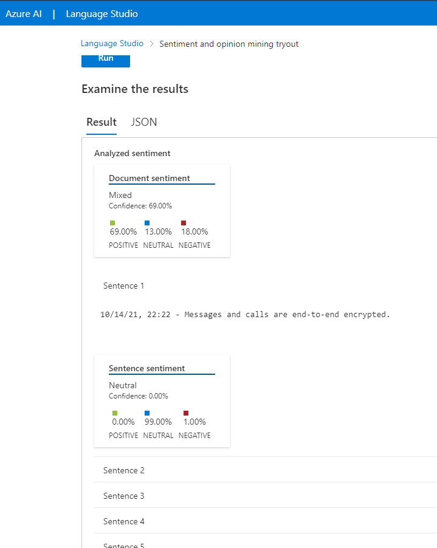
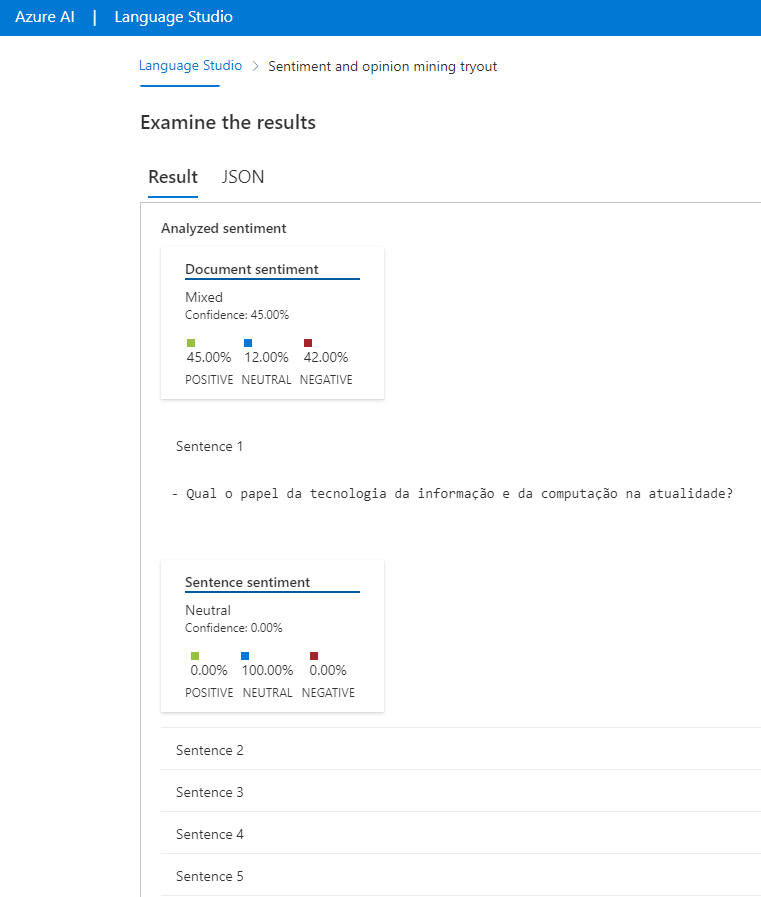
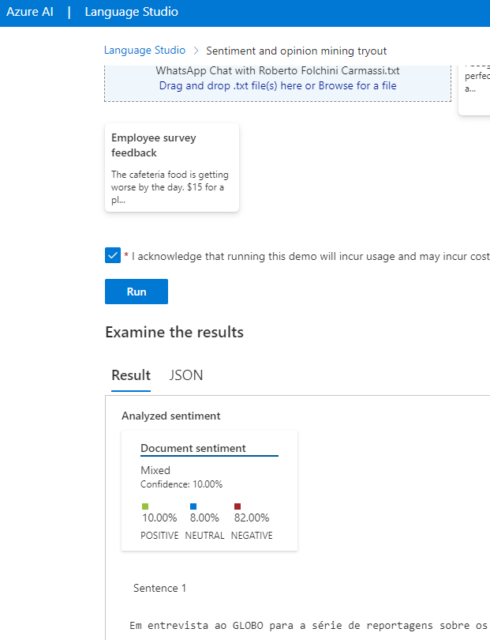
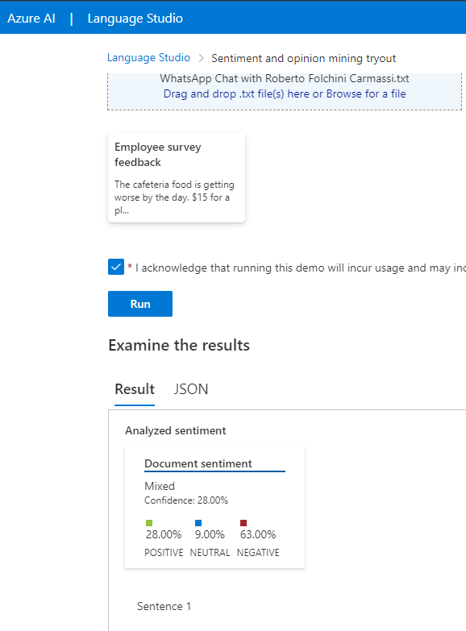

# azurelanguage

## Descrição

Muito interessante essa ferramenta de análise de sentimento. Imagino que podemo fazer muitas pesquisas e tirar muitos insights à partir dessas anáises. Abaixo os prints dos resultados de algumas análises que submeti à ferramenta de textos diversos.
O primeiro texto foi uma conversa que tive com um amigo, algo aleatório que peguei no nosso WhatsApp. POdemos ver que tem um sentimento mais positivo, ou seja, certamente não ficasmos "chorando as pitangas" um para o outro. O segunto texto analisado foi uma entrevista de alguém sobre tecnologia e, como deveria ser, vemos um resultado equilibrado que deve estat trazendo pontos positivos e negativos para análise, oportunidades e riscos na adoção da tecnolgia. O terceiro texto é sobre política, acredito que a maior parte dos textos sobre política sejam nesse nível de negatividade, opinião minha e baseada apenas nessa análise e observação ao longo do tempo - nada científico! Já o quarto e último texto é sobre um tema polêmico discutido nas redes sociais. Aí vemos que, apesar de alguns colocarem um positivismo, a foça é do negativismo. Da mesma forma que a análise anterior, acredito que nas rede sociais as pessoas se manifestem com mais força apresentando o lado negativo de tudo.

**Com as minhas opiniões eu só quis provocar uma reflexão em cada um sobre os aspectos envolvidos aqui.**

---
### Resultado de uma conversacom um amigo

---

### Resultado de uma matéria sobre tecnologia

---
### Resultado sobre uma matéria sobre polítca

---
### Resultado sobre assunto polêmico nas redes sociais

---